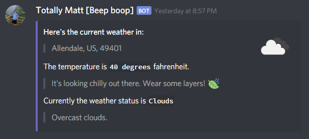

# Discord-Bot Features
> **Author:** Matthew Shan, **Updated:** 11/10/2019

## Weather
Using OpenWeatherAPI, the bot can retrieve the current weather given the current zip code.

**Usage:** ```!weather [zip code]```




## Reddit

You can also grab a random post from a given subreddit. If a subreddit is not specified, it will default to /r/ProgrammerHummor.

**Usage:** ```!reddit [subreddit name]```


## Polls

(Progress on this feature is on hold)

Each channel can have its own poll.

**Poll Commands:**

```!poll new [question]``` - Creates a new poll in the channel

```!poll add [option]``` - Adds a new option to the current poll

```!poll nudge``` - Nudges the poll in the channel

```!poll vote [letter]``` - Votes for a option given the corresponding letter

```!poll end``` - Ends the poll


## Quotes (Server must be whitelisted)

See ```!quotes help``` for more information.